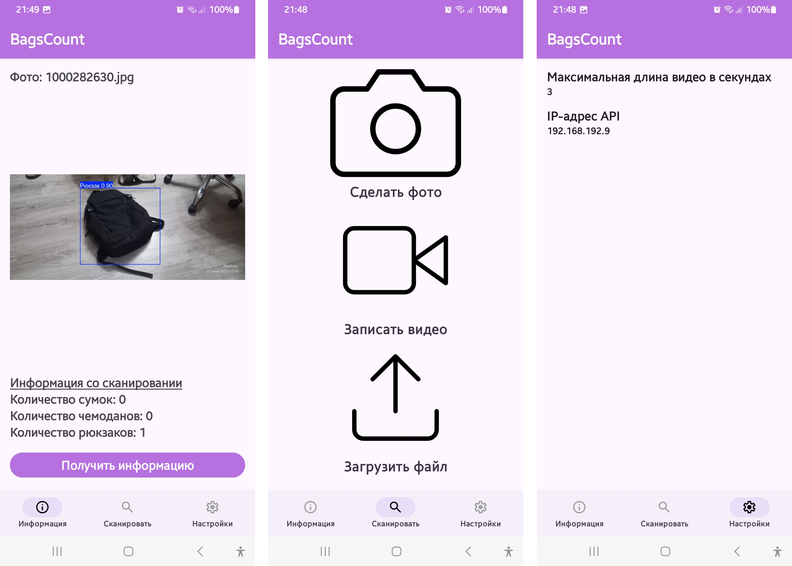
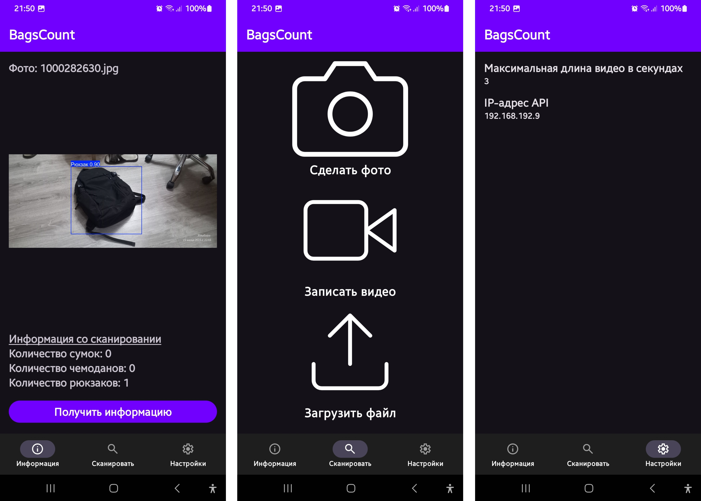
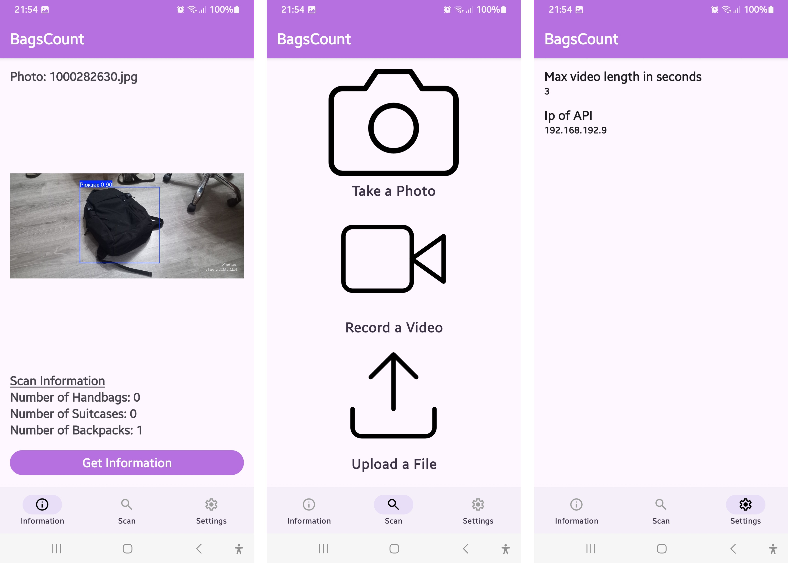

# BagSize-Mobile
Мобильное приложение для определения и подсчета сумок, рюкзаков и чемоданов на фото и видео.

Приложение нужно использовать в связке с API [Bags-classification-AI](https://github.com/Ivalip/Bags-classification-AI) с указания IP-адреса доступа.

# Приложение имеет темную тему.

# Интерфейс приложения имеет английский язык.

# Архитектура приложения

Андройд приложение состоит из 8-ми классов:
1. **MainActivity** - коренвой класс приложения для инициализация контроллера фрагментов с использованием нижнего меню навигации
2. **ScanFragment** - класс корневого фрагмента приложения. В разметке этого фрагмента входят 3 кнопки:
- "Сделать фото" - вызывает сервис камеры для съемки фото.
- "Записать видео" - вызывает сервис камеры с установленным параметром максимальной длины видео, который задается в `SharedPreferences` через фрагмент **SettingsFragment**.
- "Выбрать файл". - вызывает сервис выбора файла, разрешения которых принадлежат только фото и видео (`mp4`, `jpg`).
После подтверждения съемки или выбора файла, происходит обращение к серверу:
- Запрашивается код доступа к серверу по адресу `<ip>:5000/` с помощью команды `GET` и сохраняется в `SharedPreferences`
- Происходит загрузка на сервер файла по адресу `<ip>:5000/<код> `с помощью команды POST c указанием расширения файла.
После этого происходит сохранение этого файла в папку кэша приложения и автоматический переход во фрагмент **InfoFragment**.
3. **InfoFragment** - класс фрагмента отображения результата. В разметке этого фрагмента входит `TextView` с отображением названия файла, `ImageView` и `VideoView`на одинаковой высоте, так как будет отображаться только один из них, четыре `TextView` изначально скрытые для отображения информации о сканировании и Button. После загрузки файла на сервер и перехода в этот фрагмент на `ImageView` или `VideoView` отображается сохраненное в папку кэша изображение или видео соответственно. При нажатии на кнопку, происходит взаимодействие с сервером:
- Получает результаты сканирования по адресу `<ip>:5000/<код>` с помощью команды `GET`
- Получает размеченный медиафайл по адресу `<ip>:5000/<код>/download` с помощью команды `GET`
Полученные результаты сканирования вставляются в четыре `TextView` и включают их отображение. Полученный размеченный медиафайл сохраняется в папку кэша, вставляется в `ImageView` или `VideoView` и включает отображение.
4. **SettingsFragment** - класс фрагмента настроек. В разметке этого фрагмента включает четыре `TextView` по парам, которых определяются две настройки: настройка длительности видео и настройка IP-адреса сервера. При нажатии на одну из пар вызывается `AlertDialog` с вводом текста, где вводится параметр настройки. После применения настройки, значение обновляется в отображении и в `SharedPreferences`
5. **RetrofitClient** - класс объекта `RetrofitClient`, в котором описан созданием сервиса `Retrofit` с настроенным IP-адресом и портом из `SharePreferences` и проверкой адреса на валидность
6. **ImageUploadService** - классы интерфейса, где описаны методы с входными и выходными типами аргументов и типом обращения к серверу (`GET` или `POST`)
7. **CodeResponse** и **StatusResponse** - классы данных для обращения с сервером.
